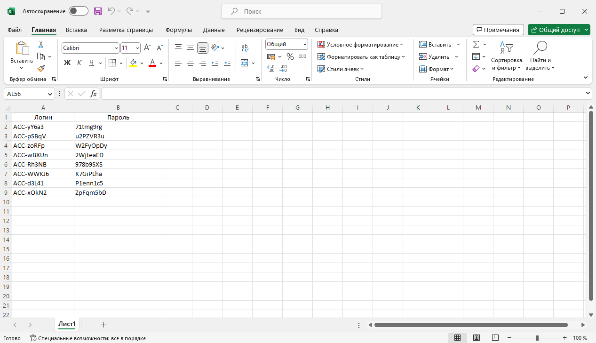
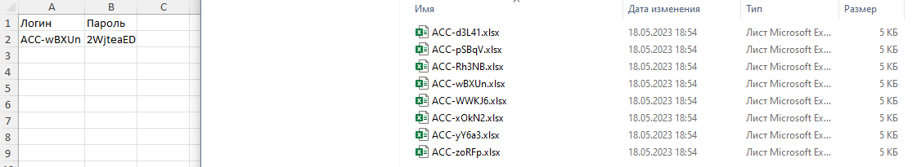

# Xlsx Splitter

There are situations where you may need to split a single XLSX file into multiple smaller files, with each file containing data row by row. For instance, if you have a spreadsheet with usernames and passwords, you might want to send each user their login details in a separate XLSX file. Manually performing this task is tedious and inefficient, particularly since each file must include the header row for clarity. Automating this process would save time and ensure consistency across all files.

## Installation
1. Clone the repository: ```git clone https://github.com/Thorgathis/XlsxSplitter.git```
2. Navigate to the program directory: ```cd XlsxSplitter```
3. Install [dependencies](https://github.com/Thorgathis/xlsx-splitter/blob/master/requirements.txt): ```pip install -r requirements.txt```

<details>
  <summary>Copy commands tree</summary>

  ```
  git clone https://github.com/Thorgathis/XlsxSplitter.git
  cd XlsxSplitter
  pip install -r requirements.txt
  ```
</details>

## Usage 

1. Make sure that the [main.py](https://github.com/Thorgathis/xlsx-splitter/blob/master/main.py)  file is in the same folder as the book.xlsx file. The program only works with this specific file name and will not accept alternatives.
2. Run programm: ```python main.py```

## Example File
The program strictly follows this structure:
 - The first column must contain the column headers.
 - The second column onward should contain the data.


Note: If any cell outside the data range has its fill color, borders, or other formatting altered, the output files will show '<strong>None</strong>' in place of those modifications.

## Output

